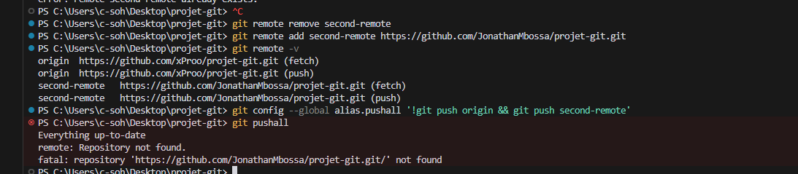
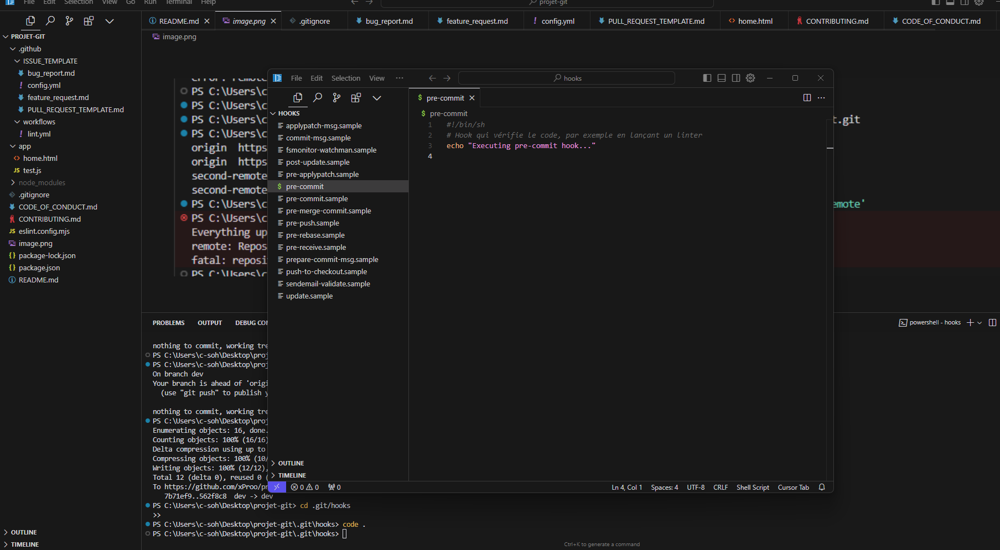
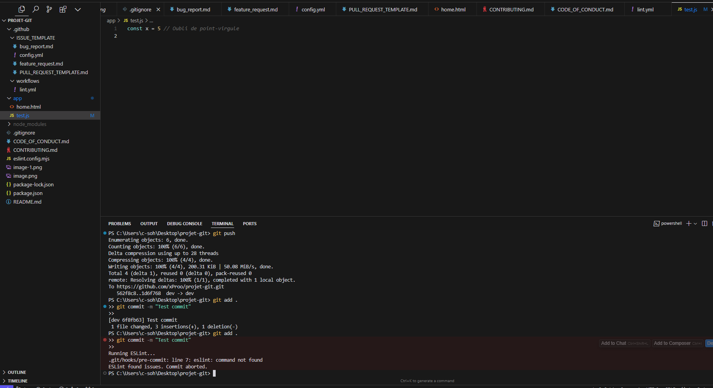
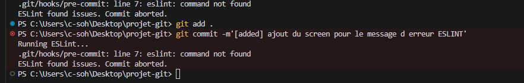
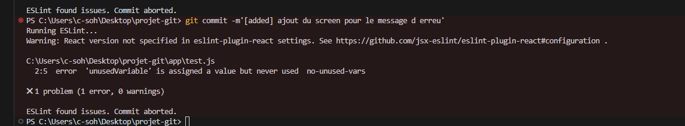
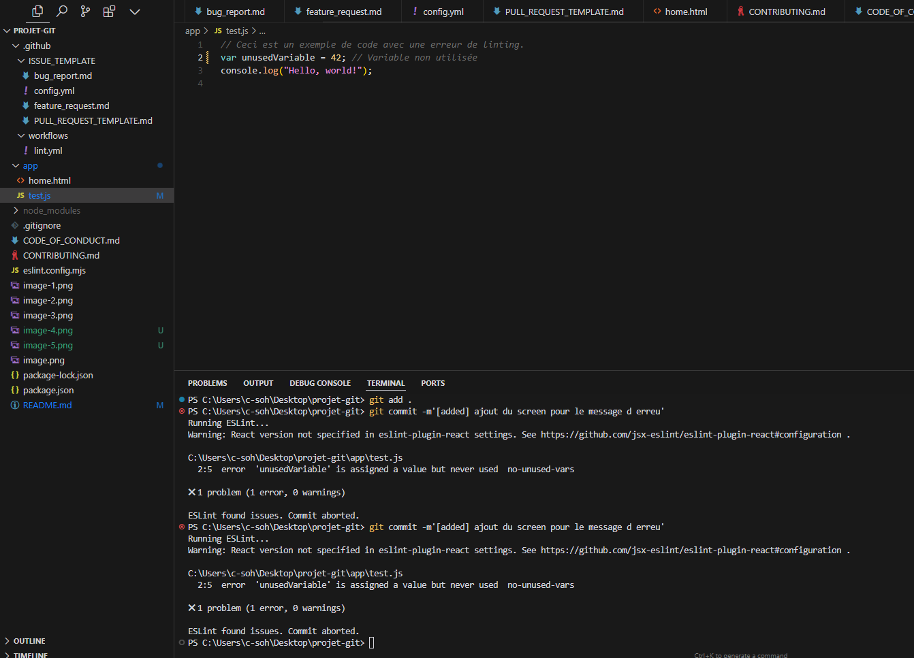
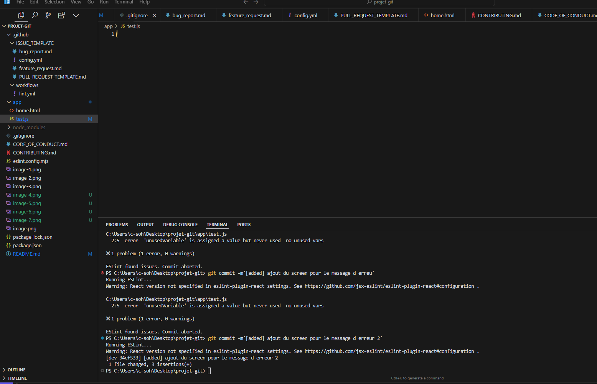

# Projet Git : Documentation

Ce document décrit les différentes étapes et fonctionnalités mises en place pour notre projet, notamment l'utilisation des branches, des hooks Git, des workflows GitHub Actions, et les messages d'erreur associés aux hooks.

## Table des matières
- [Premiers Commits](#premiers-commits)
- [Configuration des Branches et de Git Flow](#configuration-des-branches-et-de-git-flow)
- [Hooks Git et Messages d'Erreur](#hooks-git-et-messages-derreur)
- [GitHub Actions et CI/CD](#github-actions-et-cicd)

---

### Premiers Commits

Les premières modifications et ajouts au projet ont été faits dans la branche `dev`. Cela inclut les changements initiaux pour mettre en place les fonctionnalités et les différents tests.




---

### Configuration des Branches et de Git Flow

Dans ce projet, nous avons suivi le **Git Flow**, en créant plusieurs branches pour organiser les fonctionnalités et les correctifs. Voici un aperçu des branches créées :

- `main` : la branche principale utilisée pour la version stable en production.
- `develop` : branche de développement pour tester les nouvelles fonctionnalités.
- `feature/*` : branches pour chaque fonctionnalité (par exemple, `feature/navbar`, `feature/entreprise`).
- `staging` : une branche intermédiaire pour tester toutes les fonctionnalités avant de les fusionner dans `main`.
- `release/*` : branches de release pour préparer les versions avant le passage en production.
- `hotfix/*` : branches pour les corrections urgentes de bugs sur la branche `main`.

### Processus Git Flow
1. **Création d'une nouvelle branche** :
   ```bash
   git checkout develop
   git checkout -b feature/nom-de-la-fonctionnalité


### first commit






### message d'erreur lorsque le commit est bloqué par le hook.


### message d'erreur lorsque le commit est bloqué par le hook.

µ



